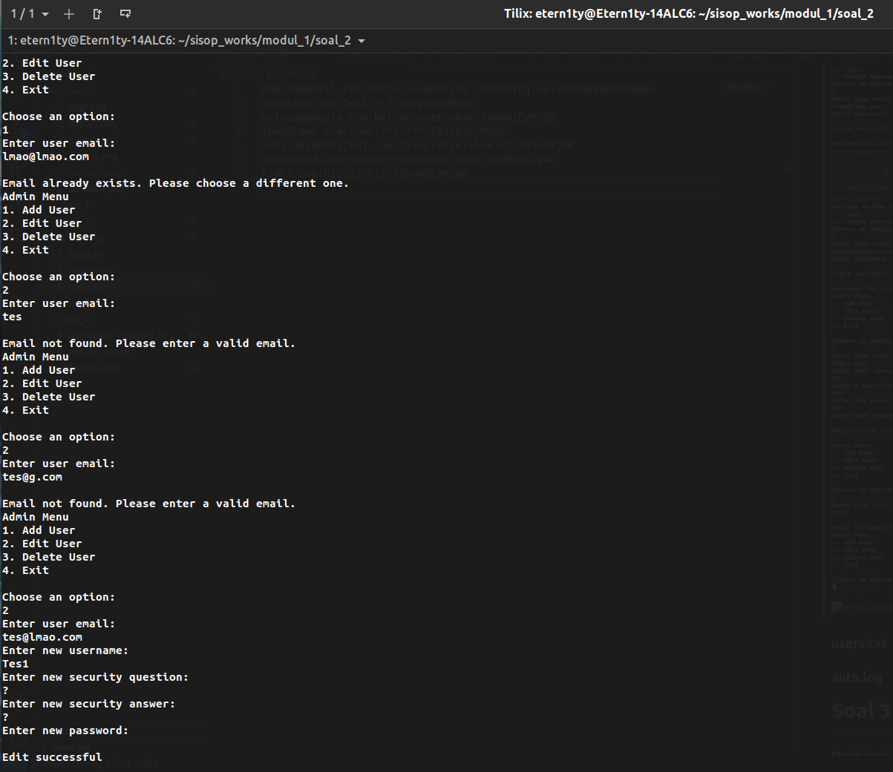
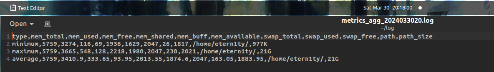

# Repository Praktikum Sistem Operasi Modul 1 - IT04

## Anggota

| Nama                      | NRP        |
|---------------------------|------------|
|Nathan Kho Pancras         | 5027231002 |
|Athalla Barka Fadhil       | 5027231018 |
|Muhammad Ida Bagus Rafi H  | 5027221059 |

## Daftar Isi

- [Soal 1](#soal-1)
- [Soal 2](#soal-2)
- [Soal 3](#soal-3)
- [Soal 4](#soal-4)

# Soal 1

**Dikerjakan oleh: Athalla Barka Fadhil (5027231018)**

### Deskripsi Soal

Cipung dan abe ingin mendirikan sebuah toko bernama “SandBox”, sedangkan kamu adalah manajer penjualan yang ditunjuk oleh Cipung dan Abe untuk melakukan pelaporan penjualan dan strategi penjualan kedepannya yang akan dilakukan.

Setiap tahun Cipung dan Abe akan mengadakan rapat dengan kamu untuk mengetahui laporan dan strategi penjualan dari “SandBox”. Buatlah beberapa kesimpulan dari data penjualan “Sandbox.csv” untuk diberikan ke cipung dan abe 

## Keterangan
   - `echo -e "\n"` digunakan untuk print new line
   - `|` pipe operator digunakan untuk memasukkan input dari command sebelumnya

## Pengaturan Awal

Menyimpan URL untuk file CSV yang ingin diunduh didalam variable `CSV_URL`

```bash
# Define CSV URL
CSV_URL='https://drive.usercontent.google.com/u/0/uc?id=1cC6MYBI3wRwDgqlFQE1OQUN83JAreId0&export=download'
```

## Mengunduh File CSV

Langkah pertama adalah mengunduh file CSV dari Google Drive menggunakan perintah `curl`.

```bash
# Download the CSV file from Google Drive
echo "=== Downloading CSV from Google Drive ==="
curl -L -o sandbox.csv "$CSV_URL"
```

Dalam perintah `curl` ini:
- `-L` digunakan untuk mengikuti redirect kalau ada.
- `-o sandbox.csv` menentukan nama file untuk menyimpan hasil unduhan.
- `"$CSV_URL"` adalah URL dari file CSV yang telah kita buat sebelumnya.

## Memeriksa Status Unduhan

Kemudian, script memeriksa apakah download tadi berhasil atau gagal.

```bash
# Check if the download was successful
echo "=== Checking download status ==="
if [ $? -ne 0 ]; then
  echo "=== Failed to download the CSV file from $CSV_URL. Exiting. ==="
  exit 1
fi
echo "=== Download successful ==="
printf "\n"
```

Dalam blok `if` ini:
- ` $?` digunakan untuk mengecek status keluaran dari perintah sebelumnya (dalam hal ini, `curl`). Jika nilai tidak sama (`-ne`) dengan `0`, itu berarti unduhan gagal.

### Pelanggan dengan Penjualan Terbanyak

```bash
# Customer with the Most Sales
echo "=== Customer with the Most Sales ==="
awk -F, '{print $17, $6}' sandbox.csv | sort -nr | head -n 1 | awk '{print $2, $3}'
echo -e "\n"
```

Dalam bagian ini:
- `awk -F, '{print $17, $6}' sandbox.csv` digunakan untuk memilih kolom 17 (Sales) dan kolom 6 (Customer Name).
- `sort -nr` digunakan untuk mengurutkan hasil secara numerik terkecil (`-n`) secara terbalik (`-r`)(dari yang terbesar ke yang terkecil).
- `head -n 1` digunakan untuk mendapatkan baris pertama (yaitu yang memiliki penjualan terbanyak).
- `awk '{print $2, $3}'` digunakan untuk mencetak first name (`$2`) dan last name (`$3`) dari Customer Name. 

### Segmen Pelanggan dengan Profit Terkecil

```bash
# Customer Segment with the Least Profit
echo "=== Customer Segment with the Least Profit ==="
awk -F, '{print $20, $7}' sandbox.csv | sort | head -n 1 | awk '{print $2, $3}'
echo -e "\n"
```
Bagian ini hampir sama dengan bagian sebelumnya, tapi kali ini kolom yang dipilih adalah kolom ke-20 (Profit) dan kolom ke-7 (Customer Segment) dan menggunakan default `sort` untuk mengurutkan profit dari terkecil.


### Kategori dengan Total Profit Tertinggi

```bash
# Categories with Most Total Profit
echo "=== Categories with Most Total Profit ==="
awk -F, '{profit[$14] += $20} END {for (category in profit) print profit[category], category}' sandbox.csv | sort -nr | head -n 3
echo -e "\n"
```


1. `awk -F, '{profit[$14] += $20} END {for (category in profit) print "Profit:", profit[category],"| Category:", category}' sandbox.csv`
   - `awk` digunakan untuk memanipulasi dan mencetak data berdasarkan aturan yang ditentukan.
   - `-F,` digunakan untuk menentukan pemisah kolom, di sini kita menggunakan koma (,) karena file CSV dipisahkan oleh koma.
   - `'{profit[$14] += $20}` digunakan untuk menghitung total profit untuk setiap kategori (kolom ke-14) dengan menambahkan nilai profit setiap baris.
   - `END {for (category in profit) print "Profit:", profit[category],"| Category:", category}` akan mencetak total profit dan nama kategori untuk setiap kategori yang tercatat dalam array `profit`.
   - `sandbox.csv` adalah nama file CSV yang digunakan sebagai input.

2. `sort -nr | head -n 3`
   - `sort -nr` digunakan untuk mengurutkan hasil secara numerik terkecil (`-n`) secara terbalik (`-r`)(dari yang tertinggi ke terendah).
   - `head -n 3` digunakan untuk mendapatkan tiga baris pertama dari hasil yang sudah diurutkan, yang akan memberikan tiga kategori dengan total profit tertinggi.


### Mendapatkan Tanggal Pesanan dan Jumlah untuk Pelanggan dengan Nama "Adriaens"

```bash
# Get Quantity and Order Date for Customer with "Adriaens"
echo "=== Getting Order Date and Quantity for Customer Named 'Adriaens' ==="
awk -F, '$6 ~ /Adriaens/ {print "Order Date: ", $2}' sandbox.csv
awk -F, '$6 ~ /Adriaens/ {print "Quantity: "$18}' sandbox.csv
echo -e "\n"
```

1. `awk -F, '$6 ~ /Adriaens/ {print "Order Date: ", $2}' sandbox.csv`
   - `awk` adalah perintah untuk memanipulasi dan mencetak data berdasarkan pola atau aturan yang ditentukan.
   - `-F,` mengatur pemisah kolom menjadi koma (,) karena file CSV biasanya pake koma sebagai pemisah
   - `'$6 ~ /Adriaens/` digunakan untuk memilih baris-baris yang nama pelanggannya (kolom ke-6) cocok dengan pola "Adriaens".
   - `{print "Order Date: ", $2}` mencetak tanggal pesanan (kolom ke-2) dari baris-baris yang dipilih sebelumnya.
   - `sandbox.csv` adalah nama file CSV yang digunakan sebagai input.

2. `awk -F, '$6 ~ /Adriaens/ {print "Quantity: "$18}' sandbox.csv`
   - Sama seperti sebelumnya, namun kali ini kita mencetak jumlah pesanan (kolom ke-18) dari baris-baris yang dipilih.

## Output

sandbox.sh


# Soal 2

**Dikerjakan oleh: Nathan Kho Pancras (5027231002)**

### Deskripsi Soal

Oppie merupakan seorang peneliti bom atom, ia ingin merekrut banyak peneliti lain untuk mengerjakan proyek bom atom nya, Oppie memiliki racikan bom atom rahasia yang hanya bisa diakses penelitinya yang akan diidentifikasi sebagai user, Oppie juga memiliki admin yang bertugas untuk memanajemen peneliti, bantulah oppie untuk membuat program yang akan memudahkan tugasnya

### Pengerjaan

> a. Buatlah 2 program yaitu login.sh dan register.sh

> b. Setiap admin maupun user harus melakukan register terlebih dahulu menggunakan email, username, pertanyaan keamanan dan jawaban, dan password

**Solusi**

1. register.sh
   
   Untuk register.sh, sesuai soal terdapat beberapa parameter, yaitu:
  
  - Email
  - Username
  - Security question
  - Security question answer
  - Password
  
  Mengetahui informasi ini, hal pertama yang saya lakukan yaitu saya membuat fungsi bernama ask_register yang berisi commands untuk input parameter-parameter diatas.

```bash
ask_register() {
    echo -e "Welcome to the registration page.\n"

    echo "Enter your email:"
    read email

    echo "Enter your username:"
    read usr

    echo "Enter a security question, something you will always know:"
    read sec_q
    
    echo "Enter the answer to your security question:"
    read sec_a

    echo "Enter password:"
    read -s pass

    echo "$email:$usr:$sec_q:$sec_a:$pass" >>users.txt
    echo -e "\nRegistration successful\n"
}
```

2. login.sh

    Sesuai dengan register, saya membuat fungsi ask_login di login.sh (dibiarkan kosong karena belum mengetahui parameter yang diperlukan)

> c. Username yang dibuat bebas, namun email bersifat unique. setiap email yang mengandung kata admin akan dikategorikan menjadi admin 

**Solusi**

Karena email unique tetapi username tidak, maka saya menambahkan sebuah if statement untuk mengecek apakah email yang diinput sudah terdaftar di register.sh dengan cara penggunaan grep, command sub dan wildcard (-q untuk melakukan suppress output)

```bash
add_user() {
    echo "Enter user email:"
    read email
    
    # ADDED
    if grep -q "^$email:.*:.*:.*:.*" users.txt; 
    then
        echo -e "\nEmail already exists. Please choose a different one."
        return 1
    fi

    echo "Enter user username:"
    read usr

    echo "Enter a security question, something the user will always know:"
    read sec_q
    
    echo "Enter the answer to your security question:"
    read sec_a

    echo "Enter user password:"
    read -s pass

    echo "$email:$usr:$sec_q:$sec_a:$pass" >>users.txt
    echo -e "\nRegistration successful\n"
}
```

> d. Karena resep bom atom ini sangat rahasia Oppie ingin password nya memuat keamanan tingkat tinggi
> - Password tersebut harus di encrypt menggunakan base64
> - Password yang dibuat harus lebih dari 8 karakter
> - Harus terdapat paling sedikit 1 huruf kapital dan 1 huruf kecil
> - Harus terdapat paling sedikit 1 angka 

**Solusi**

Mengetahui tambahan constraints yang diberikan oleh sub nomor d, maka saya menambahkan beberapa mekanisme untuk setiap constraint.

```bash
ask_register() {
    echo -e "Welcome to the registration page.\n"

    echo "Enter your email:"
    read email

    if grep -q "^$email:.*:.*:.*:.*" users.txt;
    then
        echo -e "\nEmail already exists. Please choose a different one."
        return 1
    fi

    echo "Enter your username:"
    read usr

    echo "Enter a security question, something you will always know:"
    read sec_q
    
    echo "Enter the answer to your security question:"
    read sec_a

    echo "Enter password:"
    read -s pass

    # ADDED
    while true; do
        # check more than 8 chars, has at least a capital and a normal letter, has at least a number
        if [[ ${#pass} -ge 8 && "$pass" == *[[:lower:]]* && "$pass" == *[[:upper:]]* && "$pass" == *[0-9]* ]]; then
            echo "Password meets all requirements"
            break
        else
            echo "Password does not meet the requirements"
            echo "Enter password:"
            read -s pass
        fi
    done

    # ADDED base64 encryption
    enc_pass=$(echo $pass | base64)

    echo "$email:$usr:$sec_q:$sec_a:$enc_pass" >>users.txt
    echo -e "\nRegistration successful\n"
}
```

Constraint pertama : base64 encryption dengan command base64

Constraint kedua : 

    ${#pass} -ge 8

Constraint ketiga : 
    
    "$pass" == *[[:lower:]]* && "$pass" == *[[:upper:]]*

Constraint keempat : 

    "$pass" == *[0-9]*

Untuk constraint kedua - keempat, saya membuat if statement didalam while loop yang menggabungkan semua kondisi menjadi satu, yang akan melanjutkan program hanya jika password sudah sesuai dengan constraint.

Untuk constraint pertama, saya membuat variabel baru yaitu enc_pass untuk menyimpan password yang diencode dengan base64 memasukkannya kedalam file users.txt.

> e. Karena Oppie akan memiliki banyak peneliti dan admin ia berniat untuk menyimpan seluruh data register yang ia lakukan ke dalam folder users file users.txt. Di dalam file tersebut, terdapat catatan seluruh email, username, pertanyaan keamanan dan jawaban, dan password hash yang telah ia buat.

**Solusi**

Karena saya telah memasukkan email, username, security q&a, dan encrypted password kedalam file users.txt untuk melakukan penyimpanan data, maka step ini selesai.

f. Setelah melakukan register, program harus bisa melakukan login. Login hanya perlu dilakukan menggunakan email dan password.

Saya bisa beralih dari register.sh dan mulai untuk mengerjakan login.sh sekarang karena saya sudah mengetahui parameter yang diperlukan untuk login. Sama seperti register.sh saya membuat fungsi ask_login yang meminta input email dan password.

```bash
ask_login () {
    echo "Enter your email:"
    read email

    if ! grep -q "^$email:" users.txt;
    then    
        echo -e "\nEmail not found. Please enter a valid email."
        return 1
    else
        echo "Enter password:"
        read -s pass
        enc_pass=$(echo $pass | base64)

        if grep -q "^$email:.*:.*:.*:$enc_pass" users.txt && [[ $email == *"admin"* ]]
        then
            echo -e "\nLogin successful\n"
        elif grep -q "^$email:.*:.*:.*:$enc_pass" users.txt;
        then
            echo -e "\nLogin successful\n"
        else
            echo -e "\nPassword is incorrect. Please enter the correct password."
            return 1  
        fi
    fi
}
```

Karena ada prompt dimana semua email yang mengandung kata admin menjadi admin, maka saya membuat dua if, dimana yang pertama sekaligus mengecek apakah ada kata admin di email yang diinput, jika tidak ada, akan mengecek users.txt untuk suatu kecocokan.

> g. Karena peneliti yang di rekrut oleh Oppie banyak yang sudah tua dan pelupa maka Oppie ingin ketika login akan ada pilihan lupa password dan akan keluar pertanyaan keamanan dan ketika dijawab dengan benar bisa memunculkan password

Untuk masalah ini, saya membuat fungsi baru yaitu welcome dimana ada 2 opsi sesuai soal, Login dan Forgot Password dengan switch case.

```bash
welcome () {
    echo "Welcome to the login page. Please select an option:"
    echo "1. Login"
    echo "2. Forgot Password"
    echo "Choose an option: "
    read choice

    case $choice in
    1) ask_login ;;
    2) ask_forgot ;;
    *) echo "Invalid choice" ;;
    esac
}
```

Setelah ini, saya melanjutkan dengan membuat fungsi baru lagi yaitu ask_forgot untuk opsi forgot password, dengan parameter yang keluar yaitu email, security q&a, dan password baru.

```bash
ask_forgot () {
    echo "Enter your email:"
    read email

    if ! grep -q "^$email:" users.txt;
    then
        echo -e "\nEmail not found. Please enter a valid email."
        return 1
    else
        # grep the correct sec_q and _a from email
        sec_q=$(grep "^$email:" users.txt | cut -d':' -f3)
        echo "Security question: $sec_q"

        echo "Enter your answer:"
        read sec_a

        if ! grep -q "^$email:.*:.*:$sec_a" users.txt;
        then
            echo -e "\nAnswer is incorrect. Please enter the correct answer."
            return 1
        else
            enc_pass=$(grep "^$email:" users.txt | cut -d':' -f5)
            pass=$(echo $enc_pass | base64 -d)
            echo -e "\nYour password is: $pass\n"
        fi
    fi
}
```

Untuk fungsi ask_forgot, sesuai yang diminta soal, user menginputkan email dan setelah itu dengan grep dan cut, saya bisa mengambil security question yang sesuai dengan email yang diinputkan oleh user. Kemudian saya membuat if statement sesuai input dari security question answer.

> h. Setelah user melakukan login akan keluar pesan sukses, namun setelah seorang admin melakukan login Oppie ingin agar admin bisa menambah, mengedit (username, pertanyaan keamanan dan jawaban, dan password), dan menghapus user untuk memudahkan kerjanya sebagai admin. 

Mengetahui hal ini, saya membuat beberapa fungsi baru, dengan skema sebagai berikut:
1. admin ()
  
  - add_user ()
  - edit_user ()
  - delete_user ()
  
2. member ()

Fungsi admin dan member akan dijalankan sesuai if statement pada login.
    
```bash
if grep -q "^$email:.*:.*:.*:$enc_pass" users.txt && [[ $email == *"admin"* ]]
then    
    echo -e "\nLogin successful\n"
    # ADDED
    admin
elif grep -q "^$email:.*:.*:.*:$enc_pass" users.txt;
then
    echo -e "\nLogin successful\n"
    # ADDED
    member
else
    echo -e "\nPassword is incorrect. Please enter the correct password."
    return 1  
fi
```

Kemudian, untuk admin, sesuai skema, akan diberikan 3 option (+1 untuk exit), sehingga mirip seperti fungsi welcome pada awal program.

```bash
admin () {
    echo "Welcome! You currently have admin privileges."
    while true; do
        echo "Admin Menu"
        echo "1. Add User"
        echo "2. Edit User"
        echo "3. Delete User"
        echo -e "4. Exit \n"
        
        echo "Choose an option: "
        read choice

        case $choice in
        1) add_user ;;
        2) edit_user ;;
        3) delete_user ;;
        4) 
            echo "Exiting..."
            break
            ;;
        *) echo "Invalid choice" ;;
        esac
    done
}
```

Masuk kedalam fungsi-fungsi khusus admin, ada add_user, edit_user, dan delete_user. Untuk add_user sistemnya mirip dengan register user baru.

```bash
add_user() {
    echo "Enter user email:"
    read email

    if grep -q "^$email:.*:.*:.*:.*" users.txt; 
    then
        echo -e "\nEmail already exists. Please choose a different one."
        return 1
    fi

    echo "Enter user username:"
    read usr

    echo "Enter a security question, something the user will always know:"
    read sec_q
    
    echo "Enter the answer to your security question:"
    read sec_a

    echo "Enter user password:"
    read -s pass

    enc_pass=$(echo $pass | base64)

    echo "$email:$usr:$sec_q:$sec_a:$enc_pass" >>users.txt
    echo -e "\nRegistration successful\n"
}

edit_user() {

}

delete_code() {

}
```

> i. Ketika admin ingin melakukan edit atau hapus user, maka akan keluar input email untuk identifikasi user yang akan di hapus atau di edit

```bash
edit_user () {
    echo "Enter user email:"
    read email

    if ! grep -q "^$email:.*:.*:.*:.*" users.txt;
    then
        echo -e "\nEmail not found. Please enter a valid email."
        return 1
    else
        echo "Enter new username:"
        read new_usr

        echo "Enter new security question:"
        read new_sec_q

        echo "Enter new security answer:"
        read new_sec_a

        echo "Enter new password:"
        read -s new_pass
        
        newenc_pass=$(echo $new_pass | base64)

        # replace the existing line with the new values
        sed -i "/^$email:/c\\$email:$new_usr:$new_sec_q:$new_sec_a:$newenc_pass" users.txt
        echo -e "\nEdit successful\n"
    fi
}

delete_user () {
    echo "Enter user email:"
    read email

    if ! grep -q "^$email:" users.txt;
    then
        echo -e "\nEmail not found. Please enter a valid email."
        return 1
    else
        # delete the line
        sed -i "/^$email:/d" users.txt
        echo -e "\nDelete successful\n"
    fi
}
```

Dalam fungsi edit_user dan delete_user, terdapat penggunaan command sed untuk melakukan edit pada file users.txt, dimana di edit_user, sed bekerja untuk mengganti value lama dengan value baru, sedangkan di delete_user, sed akan menghapus line yang berkaitan dengan email yang diinput. Pemakaian sed dilakukan karena operasi yang dijalankan tidak terlalu sulit, sehingga sed sudah cukup, tidak perlu memakai awk.

- -i merupakan parameter yang berfungsi agar sed mengeluarkan outputnya kedalam file, bukan ke terminal
- c merupakan command untuk melakukan substitusi

> j. Oppie ingin programnya tercatat dengan baik, maka buatlah agar program bisa mencatat seluruh log ke dalam folder users file auth.log, baik login ataupun register.
> 
>> Format: [date] [type] [message]
>
>> Type: REGISTER SUCCESS, REGISTER FAILED, LOGIN SUCCESS, LOGIN FAILED
>
>> Ex:
[23/09/17 13:18:02] [REGISTER SUCCESS] user [username] registered successfully
[23/09/17 13:22:41] [LOGIN FAILED] ERROR Failed login attempt on user with email [email]

Untuk sub nomor ini, diperlukan tambahan echo untuk melakukan logging pada fungsi yang melibatkan register dan login. Untuk logging sendiri, bisa menggunakan command date untuk menambah data waktu dilakukan fungsi.

**1. register.sh**
   
```bash
ask_register() {
    echo -e "Welcome to the registration page.\n"

    echo "Enter your email:"
    read email

    if grep -q "^$email:.*:.*:.*:.*" users.txt;
    then
        echo -e "\nEmail already exists. Please choose a different one."
        echo "$(date '+[%d/%m/%y %H:%M:%S]') [REGISTER FAILED] ERROR Failed register attempt with error: "Email already exists": [$email]" >> auth.log
        return 1
    fi

    if [[ $email != "*@*.*" ]];
    then
        echo -e "\nEmail is invalid."
        echo "$(date '+[%d/%m/%y %H:%M:%S]') [REGISTER FAILED] ERROR Failed register attempt with error: "Email is invalid": [$email]" >> auth.log
        return 1
    fi

    echo "Enter your username:"
    read usr

    echo "Enter a security question, something you will always know:"
    read sec_q
    
    echo "Enter the answer to your security question:"
    read sec_a

    echo "Enter password:"
    read -s pass
    while true; do
        # check more than 8 chars, has at least a capital and a normal letter, has at least a number
        if [[ ${#pass} -ge 8 && "$pass" == *[[:lower:]]* && "$pass" == *[[:upper:]]* && "$pass" == *[0-9]* ]]; 
        then
            echo "Password meets all requirements"
            break
        else
            echo "Password does not meet the requirements"
            echo "Enter password:"
            read -s pass
        fi
    done

    # Add base64 encryption
    enc_pass=$(echo $pass | base64)

    echo "$email:$usr:$sec_q:$sec_a:$enc_pass" >>users.txt
    echo -e "\nRegistration successful\n"
    echo "$(date '+[%d/%m/%y %H:%M:%S]') [REGISTER SUCCESS] user [$usr] registered successfully" >> auth.log
}

ask_register
```

**2. login.sh**

```bash
add_user() {
    echo "Enter user email:"
    read email

    if grep -q "^$email:.*:.*:.*:.*" users.txt; 
    then
        echo -e "\nEmail already exists. Please choose a different one."
        echo "$(date '+[%d/%m/%y %H:%M:%S]') [REGISTER FAILED] ERROR Failed register attempt with error: "Email already exists": [$email]" >> auth.log
        return 1
    fi

    if [[ $email != "*@*.*" ]];
    then
        echo -e "\nEmail is invalid."
        echo "$(date '+[%d/%m/%y %H:%M:%S]') [REGISTER FAILED] ERROR Failed register attempt with error: "Email is invalid": [$email]" >> auth.log
        return 1
    fi

    echo "Enter user username:"
    read usr

    echo "Enter a security question, something the user will always know:"
    read sec_q
    
    echo "Enter the answer to your security question:"
    read sec_a

    echo "Enter user password:"
    read -s pass

    enc_pass=$(echo $pass | base64)

    echo "$email:$usr:$sec_q:$sec_a:$enc_pass" >>users.txt
    echo -e "\nRegistration successful\n"
    echo "$(date '+[%d/%m/%y %H:%M:%S]') [REGISTER SUCCESS] user [$usr] registered successfully" >> auth.log
}

edit_user () {
    echo "Enter user email:"
    read email

    if ! grep -q "^$email:.*:.*:.*:.*" users.txt;
    then
        echo -e "\nEmail not found. Please enter a valid email."
        return 1
    else
        echo "Enter new username:"
        read new_usr

        echo "Enter new security question:"
        read new_sec_q

        echo "Enter new security answer:"
        read new_sec_a

        echo "Enter new password:"
        read -s new_pass
        
        newenc_pass=$(echo $new_pass | base64)

        # replace the existing line with the new values
        sed -i "/^$email:/c\\$email:$new_usr:$new_sec_q:$new_sec_a:$newenc_pass" users.txt
        echo -e "\nEdit successful\n"
    fi
}

delete_user () {
    echo "Enter user email:"
    read email

    if ! grep -q "^$email:" users.txt;
    then
        echo -e "\nEmail not found. Please enter a valid email."
        return 1
    else
        # delete the line
        sed -i "/^$email:/d" users.txt
        echo -e "\nDelete successful\n"
    fi
}

admin () {
    echo "Welcome! You currently have admin privileges."
    while true; do
        echo "Admin Menu"
        echo "1. Add User"
        echo "2. Edit User"
        echo "3. Delete User"
        echo -e "4. Exit \n"
        
        echo "Choose an option: "
        read choice

        case $choice in
        1) add_user ;;
        2) edit_user ;;
        3) delete_user ;;
        4) 
            echo "Exiting..."
            break
            ;;
        *) echo "Invalid choice" ;;
        esac
    done
}

member () {
    echo "Welcome! You currently have member privileges."
}

ask_login () {
    echo "Enter your email:"
    read email

    if ! grep -q "^$email:" users.txt;
    then    
        echo -e "\nEmail not found. Please enter a valid email."
        return 1
    else    
        echo "Enter password:"
        read -s pass

        usr=$(grep "^$email:" users.txt | cut -d':' -f2)
        enc_pass=$(echo $pass | base64)

        if grep -q "^$email:.*:.*:.*:$enc_pass" users.txt && [[ $email == *"admin"* ]]
        then    
            echo -e "\nLogin successful\n"
            echo "$(date '+[%d/%m/%y %H:%M:%S]') [LOGIN SUCCESS] user [$usr] logged in successfully" >> auth.log
            admin
        elif grep -q "^$email:.*:.*:.*:$enc_pass" users.txt;
        then
            echo -e "\nLogin successful\n"
            echo "$(date '+[%d/%m/%y %H:%M:%S]') [LOGIN SUCCESS] user [$usr] logged in successfully" >> auth.log
            member
        else
            echo -e "\nPassword is incorrect. Please enter the correct password."
            echo "$(date '+[%d/%m/%y %H:%M:%S]') [LOGIN FAILED] ERROR Failed login attempt on user with email [$email]" >> auth.log
            return 1  
        fi
    fi
}

ask_forgot () {
    echo "Enter your email:"
    read email

    if ! grep -q "^$email:" users.txt;
    then
        echo -e "\nEmail not found. Please enter a valid email."
        return 1
    else
        # grep the correct sec_q and _a from email
        sec_q=$(grep "^$email:" users.txt | cut -d':' -f3)
        echo "Security question: $sec_q"

        echo "Enter your answer:"
        read sec_a

        if ! grep -q "^$email:.*:.*:$sec_a" users.txt;
        then
            echo -e "\nAnswer is incorrect. Please enter the correct answer."
            return 1
        else
            enc_pass=$(grep "^$email:" users.txt | cut -d':' -f5)
            pass=$(echo $enc_pass | base64 -d)
            echo -e "\nYour password is: $pass\n"
        fi
    fi
}

welcome () {
    echo "Welcome to the login page. Please select an option:"
    echo "1. Login"
    echo "2. Forgot Password"
    echo "Choose an option: "
    read choice

    case $choice in
    1) ask_login ;;
    2) ask_forgot ;;
    *) echo "Invalid choice" ;;
    esac
}

welcome
```
---

Output
-

### register.sh


### login.sh





### users.txt


### auth.log


# Soal 3

**Dikerjakan oleh: Muhammad Ida Bagus Rafi H (5027221059)**

### Deskripsi Soal
Alyss adalah seorang gamer yang sangat menyukai bermain game Genshin Impact. Karena hobinya, dia ingin mengoleksi foto-foto karakter Genshin Impact. Suatu saat Yanuar memberikannya sebuah Link yang berisi koleksi kumpulan foto karakter dan sebuah clue yang mengarah ke penemuan gambar rahasia. Ternyata setiap nama file telah dienkripsi dengan menggunakan hexadecimal. Karena penasaran dengan apa yang dikatakan Yanuar, Alyss tidak menyerah dan mencoba untuk mengembalikan nama file tersebut kembali seperti semula.

## Pengerjaan
> Note:
> - Unduh file koleksi karakter Genshin Impact dari URL yang diberikan
> - Lakukan ekstraksi terhadap file yang telah diunduh
> - Dekode nama file yang terenkripsi dengan hexadecimal
> - Rename setiap file berdasarkan data karakter yang terdapat dalam file list_character.csv
> - Hitung jumlah pengguna untuk setiap senjata yang ada
> - Hapus file yang tidak diperlukan setelah proses selesai

## Pembuatan awal.sh
> 1.Unduh file dari URL yang diberikan
```bash
echo "=== Downloading files ==="
wget -q -O genshin_character.zip "URL_Genshin_Character.zip"
wget -q -O list_character.csv "URL_List_Character.csv"
wget -q -O genshin.zip "URL_Genshin.zip"
```
>2.Ekstrak file yang telah diunduh
```bash
echo "=== Extracting files ==="
unzip -q genshin_character.zip
unzip -q genshin.zip
```
>3.Dekode nama file yang terenkripsi dengan hexadecimal
```bash
echo "=== Decoding filenames ==="
for file in *.jpg; do
    decoded_name=$(echo "$file" | xxd -r -p)
    mv "$file" "$decoded_name"
done
```
>4.Rename file berdasarkan data karakter dari list_character.csv
```bash
echo "=== Renaming files ==="
while IFS=, read -r region nama elemen senjata; do
    mv "$region"_"$nama"_"$elemen"_"$senjata".jpg "$region"_"$nama"_"$elemen"_"$senjata".jpg
done < list_character.csv
```
>5.Hitung jumlah pengguna untuk setiap senjata
```bash
echo "=== Counting users for each weapon ==="
declare -A weapon_count
for file in *.jpg; do
    senjata=$(echo "$file" | cut -d'_' -f4)
    ((weapon_count[$senjata]++))
done
```
>6.Tampilkan jumlah pengguna untuk setiap senjata
```bash
for senjata in "${!weapon_count[@]}"; do
    echo "$senjata : ${weapon_count[$senjata]}"
done
```
>7.Hapus file yang tidak diperlukan
```bash
echo "=== Removing unnecessary files ==="
rm -f genshin_character.zip list_character.csv genshin.zip
```

## Pembuatan search.sh
>1.Inisialisasi pencatatan log
```bash
log_file="image.log"
touch "$log_file"
```
>2.Pencarian gambar tersembunyi
```bash
echo "=== Searching for hidden images ==="
while true; do
    for image in *.jpg; do
        # Ekstrak nilai dari setiap gambar menggunakan steghide
        extracted_txt=$(steghide extract -sf "$image" -p "" 2>/dev/null | grep "extracted")
        if [[ -n "$extracted_txt" ]]; then
            # Jika hasil ekstraksi adalah file txt yang dicari, simpan hasil dekripsi
            # Jika bukan, hapus file txt tersebut
            if [[ "$extracted_txt" == *"txt"* ]]; then
                decrypted_content=$(xxd -r -p "$extracted_txt")
                echo "$decrypted_content" > "$image.txt"
                echo "$(date +'%d/%m/%y %H:%M:%S') [FOUND] $image" >> "$log_file"
                # Temukan url yang dicari, dan hentikan script
                if [[ "$decrypted_content" == *"URL_Yang_Dicari"* ]]; then
                    echo "URL found: $decrypted_content"
                    exit 0
                fi
            else
                rm "$extracted_txt"
            fi
        fi
    done
    sleep 1
done
```

## Hasil Akhir
> Note:
> - Pastikan kedua skrip memiliki izin eksekusi (chmod +x awal.sh search.sh).
> - Jalankan skrip awal.sh dengan perintah ./awal.sh untuk memproses unduhan, ekstraksi, perubahan nama file, dan penghitungan senjata.
> - Setelah itu, jalankan skrip search.sh dengan perintah ./search.sh untuk memulai pencarian gambar tersembunyi.

## output
awal.sh


search.sh


# Soal 4

**Dikerjakan oleh: Nathan Kho Pancras (5027231002)**

### Deskripsi Soal

Stitch sangat senang dengan PC di rumahnya. Suatu hari, PC nya secara tiba-tiba nge-freeze 🤯 Tentu saja, Stitch adalah seorang streamer yang harus setiap hari harus bermain game dan streaming.  Akhirnya, dia membawa PC nya ke tukang servis untuk diperbaiki. Setelah selesai diperbaiki, ternyata biaya perbaikan sangat mahal sehingga dia harus menggunakan uang hasil tabungan nya untuk membayarnya. Menurut tukang servis, masalahnya adalah pada CPU dan GPU yang overload karena gaming dan streaming sehingga mengakibatkan freeze pada PC nya. Agar masalah ini tidak terulang kembali, Stitch meminta kamu untuk membuat sebuah program monitoring resource yang tersedia pada komputer.
Buatlah program monitoring resource pada PC kalian. Cukup monitoring ram dan monitoring size suatu directory. Untuk ram gunakan command `free -m`. Untuk disk gunakan command `du -sh <target_path>`. Catat semua metrics yang didapatkan dari hasil `free -m`. Untuk hasil `du -sh <target_path>` catat size dari path directory tersebut. Untuk target_path yang akan dimonitor adalah /home/{user}/. 

Pengerjaan
-

> Note:
> - Nama file untuk script per menit adalah minute_log.sh
> - Nama file untuk script agregasi per jam adalah aggregate_minutes_to_hourly_log.sh
> - Semua file log terletak di /home/{user}/log
> - Semua konfigurasi cron dapat ditaruh di file skrip .sh nya masing-masing dalam bentuk comment
> 
>> a. Masukkan semua metrics ke dalam suatu file log bernama metrics_{YmdHms}.log. {YmdHms} adalah waktu disaat file script bash kalian dijalankan. Misal dijalankan pada 2024-03-20 15:00:00, maka file log yang akan tergenerate adalah metrics_20240320150000.log. 
>
>> b. Script untuk mencatat metrics diatas diharapkan dapat berjalan otomatis pada setiap menit. 
>
>> c. Kemudian, buat satu script untuk membuat agregasi file log ke satuan jam. Script agregasi akan memiliki info dari file-file yang tergenerate tiap menit. Dalam hasil file agregasi tersebut, terdapat nilai minimum, maximum, dan rata-rata dari tiap-tiap metrics. File agregasi akan ditrigger untuk dijalankan setiap jam secara otomatis. Berikut contoh nama file hasil agregasi metrics_agg_2024032015.log dengan format metrics_agg_{YmdH}.log 
>
>> d. Karena file log bersifat sensitif pastikan semua file log hanya dapat dibaca oleh user pemilik file. 

minute_log.sh
-
   
Untuk hal yang pertama kali saya lakukan yaitu melakukan inisialisasi seperti berikut:

```bash
path_="/home/$(whoami)"
log_path="$path_/log"
cur_time=$(date +"%Y%m%d%H%M%S")

cd "$path_"
ram_usage=$(free -m)
disk=$(du -sh $path_)
```

Saya membuat beberapa variabel, dengan keterangan sebagai berikut:

- path_ : path untuk melakukan free -m
- log_path : path untuk menaruh file log
- cur_time : berisi date dengan format y/m/d h:m:s, jadi misal "20240326192420" pada 26 Maret 2024 pukul 19:24:20
- ram_usage : berisi hasil dari free -m
- disk : berisi hasil dari du -sh ke path_

Kemudian saya menambah satu if else statement untuk membuat log_path jika belum ada.

```bash
if [[ ! -d "$log_path" ]]; 
then
    mkdir "$log_path"
fi

cd "$log_path"
```

Setelah itu, saya melakukan pengambilan value yang diinginkan dari variabel ram_usage dan disk dengan penggunaan cut dan echo ke variabel-variabel baru.

```bash
mem_total=$(echo $ram_usage | cut -d ' ' -f8)
mem_used=$(echo $ram_usage | cut -d ' ' -f9)
mem_free=$(echo $ram_usage | cut -d ' ' -f10)
mem_shared=$(echo $ram_usage | cut -d ' ' -f11)
mem_buff=$(echo $ram_usage | cut -d ' ' -f12)
mem_available=$(echo $ram_usage | cut -d ' ' -f13)

swap_total=$(echo $ram_usage | cut -d ' ' -f15) 
swap_used=$(echo $ram_usage | cut -d ' ' -f16)
swap_free=$(echo $ram_usage | cut -d ' ' -f17)

path_size=$(echo $disk | cut -d ' ' -f1)
```

Saya pun memasukkan semua variabel yang berisi data yang diinginkan dari free -m dan melakukan echo ke metrics_$cur_time.log sesuai yang diminta soal.

```bash
echo mem_total,mem_used,mem_free,mem_shared,mem_buff,mem_available,swap_total,swap_used,swap_free,path,path_size >> "metrics_$cur_time.log"

echo $mem_total,$mem_used,$mem_free,$mem_shared,$mem_buff,$mem_available,$swap_total,$swap_used,$swap_free,$path_/,$path_size >> "metrics_$cur_time.log"
```

Terakhir, saya mengubah permission agar log hanya dapat dibaca oleh pemilik file dengan chmod 600.

```bash
chmod 600 "metrics_$cur_time.log"
```

aggregate_minutes_to_hourly_log.sh
-

Pertama saya melakukan inisialisasi beberapa variabel, sama seperti minute_log.sh.

```bash
path_="/home/$(whoami)/log"
cd "$path_"
cur_time=$(date +"%Y%m%d%H")
aggr_hour=$(date -d '-1 hour' +%Y%m%d%H)
```

Keterangan:
path_ : lokasi log
cur_time : sama seperti minute_log tetapi tidak ada minute dan second
aggr_hour : date yang dikurangi 1 jam untuk melakukan aggregate pada data-data minute_log yang sudah ada dari 1 jam sebelum aggregate.

Setelah itu, saya mengambil data-data metrics yang sudah digenerate oleh cron dan minute_log.sh dengan find dan awk untuk data disk.

```bash
find ! -name '*agg*' -name "metrics_*.log" -name "*$aggr_hour*" -exec awk -F "," 'END{log_=sprintf("numfmt --from=iec %s",$11);
log_ | getline fix_log; close(log_); print $0","  fix_log}' {} \; > tempaggr.txt
```

Constraints:

- name tidak mengandung agg
- name mengandung metrics_(wildcard).log
- name mengandung aggr_hour

Awk digunakan untuk mengubah format data disk (path_size) dari minute_log dari iec ke integer agar bisa dilakukan operasi avg dengan penggunaan sprintf.

Setelah itu, akan dilakukan proses aggregate mulai dari nilai minimum.

```bash
echo "type,mem_total,mem_used,mem_free,mem_shared,mem_buff,mem_available,swap_total,swap_used,swap_free,path,path_size" > "metrics_agg_$cur_time.log" # header

awk -F "," 'BEGIN {for (i=1; i<=9; i++) t[i] = ""; t[12] = 999999} 
{for (i=1; i<=9; i++) if (NR==1 || $i < t[i]) t[i] = $i; if ($12 < t[12]) t[12] = $12} 
END {printf "minimum,"; for (i=1; i<=9; i++) printf t[i]","; printf $10","; disk=sprintf("numfmt --to=iec %d",t[12]); disk | getline fixed; close(disk); print fixed}
' tempaggr.txt | paste -s -d '' >> "metrics_agg_$cur_time.log"
```

Penjelasan awk :
- -F ",', field separator/delimiter yaitu ,
- Blok BEGIN
  
  1. For loop pertama melakukan inisialisasi ke t[i] dari i = 1 sampai 9. Sedangkan t[12] merupakan kasus spesial sehingga perlu dilakukan inisialisasi ke nilai yang cukup besar agar bisa mengambil minimum.
  2. For loop kedua melakukan comparison dengan awalnya NR==1 dan ($i < t[i]) untuk terus menerus mencari nilai minimum untuk setiap column. (tidak ada operasi yang berlangsung saat i == 10 && i == 11)

- Setelah END, dilakukan printing untuk t[i] (i 1-9), $10 (disk), dan t[12]. Namum karena t[12] adalah kasus spesial dimana data awal memiliki format iec kita ubah lagi ke iec dengan cara yabng sama, hanya berbeda di --to-iec.
- Input awk merupakan tempaggr.txt
- Outputnya disimpan ke "metrics_agg_$cur_time.log" dengan paste -s -d ''
 
Untuk awk nilai maximum hanya berbeda di tanda yang dipakai.

```bash
awk -F "," 'BEGIN {for (i=1; i<=9; i++) t[i] = ""; t[12] = -999999}
{for (i=1; i<=9; i++) if (NR==1 || $i > t[i]) t[i] = $i; if ($12 > t[12]) t[12] = $12} 
END {printf "maximum,"; for (i=1; i<=9; i++) printf t[i]","; printf $10","; disk=sprintf("numfmt --to=iec %d",t[12]); disk | getline fixed; close(disk); print fixed}
' tempaggr.txt | paste -s -d '' >> "metrics_agg_$cur_time.log"
```

Untuk nilai average awk kembali digunakan, dengan workflow yang mirip dengan nilai min/max.

Perbedaan utama terletak di for di blok BEGIN yang kedua, dimana for ini akan menambah semua data di column sesuai i kemudian dibagi dengan jumlah row.

```bash
awk -F "," 'BEGIN {for (i=1; i<=9; i++) t[i] = 0; t[12] = 0} 
{for (i=1; i<=9; i++) t[i]+=$i; t[12]+=$12} 
END {printf "average,";  for (i=1; i<=9; i++) printf t[i]/NR","; printf $10","; disk=sprintf("numfmt --to=iec %d",t[12]/NR); disk | getline fixed; close(disk); print fixed}
' tempaggr.txt | paste -s -d '' >> "metrics_agg_$cur_time.log"
```

Terakhir, sama seperti minute_log.sh kita mengubah permission di hasil aggregate dengan chmod 600 dan juga menghapus temp file yaitu tempaggr.txt.

```bash
chmod 600 $"metrics_agg_$cur_time.log"
rm tempaggr.txt
```

Output
-

### minute_log.sh

 

### aggregate_minutes_to_hourly_log.sh 
(mengambil data min_log yang ada 1 jam sebelumnya)

 
